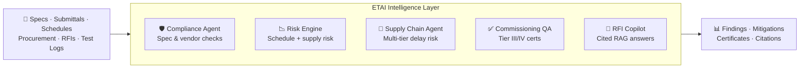
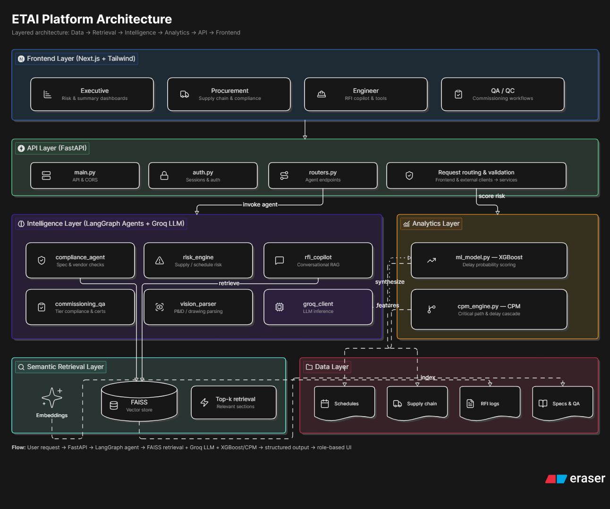
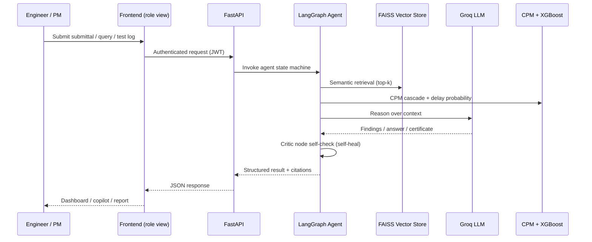
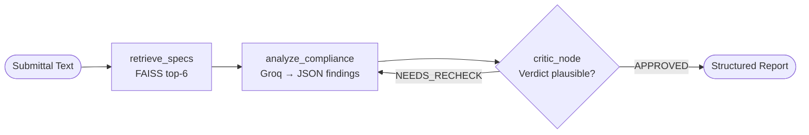
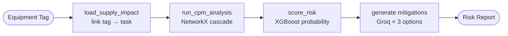
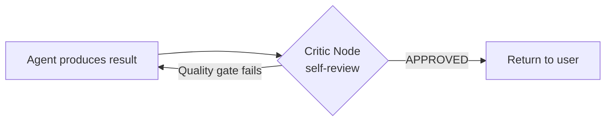

# ETAI — AI Intelligence Platform for Data Centre EPC Project Delivery

> **A living intelligence layer that unifies specifications, submittals, schedules, procurement, RFIs, and commissioning logs — turning reactive coordination into proactive, cited, decision support for hyperscale data centre construction.**

| | |
|---|---|
| **Problem Statement** | PS 1: AI-Powered Industrial Safety Intelligence for Zero-Harm Operations / Data Centre EPC Delivery Intelligence |
| **Team** | A. Nikhitha · Ch. Haswanth Sai Sarath |
| **Category** | Industrial AI · Infrastructure Construction · Quality Management |
| **Prototype Status** | Working full-stack prototype (FastAPI backend + 5 LangGraph agents + FAISS RAG + XGBoost + CPM engine) |

---

## Table of Contents

1. [Executive Summary](#1-executive-summary)
2. [Problem Context](#2-problem-context)
3. [Challenge Statement](#3-challenge-statement)
4. [Solution Overview — The Five Intelligence Agents](#4-solution-overview--the-five-intelligence-agents)
5. [System Architecture](#5-system-architecture)
6. [Deep Dive — How Each Agent Works](#6-deep-dive--how-each-agent-works)
7. [The Self-Healing Agent Pattern](#7-the-self-healing-agent-pattern)
8. [Data Layer & Demo Scenario](#8-data-layer--demo-scenario)
9. [Technology Stack](#9-technology-stack)
10. [Security & Access Control](#10-security--access-control)
11. [Demo Walkthrough](#11-demo-walkthrough)
12. [Business Value & Impact](#12-business-value--impact)
13. [Evaluation Metrics](#13-evaluation-metrics)
14. [Roadmap](#14-roadmap)
15. [Why ETAI Wins](#15-why-etai-wins)

---

## 1. Executive Summary

**ETAI** is an AI-powered intelligence platform that solves the delivery complexity of hyperscale data centre EPC (Engineering, Procurement, Construction) projects in India. It unifies siloed project data such as equipment specifications, vendor submittals, schedules, procurement records, RFIs, and commissioning logs into a single **living intelligence layer**.

Instead of engineers manually cross-referencing thousands of documents across disconnected systems, ETAI deploys **five specialised AI agents** that continuously reason over project data to:

- **Catch specification deviations** before equipment reaches site.
- **Predict schedule risk** weeks in advance, providing mitigation options and not just alerts.
- **Track multi-tier supply chain risk** for critical equipment.
- **Automate commissioning quality assurance** against Tier III / IV standards.
- **Answer engineering and contractual queries in seconds** with inline citations.

The platform is built on a modern agentic architecture that combines FastAPI, LangGraph state machines, Groq LLMs, FAISS semantic retrieval, XGBoost prediction, and NetworkX CPM modelling, designed for the high-stakes, high-complexity environment of hyperscale infrastructure builds.

---

## 2. Problem Context

### India's data centre boom

| Metric | 2024 | 2027 (Projected) |
|---|---|---|
| National capacity | ~900 MW | 2,700+ MW |
| Capital deployment | — | $15 billion+ |
| Equipment line items per facility | 15,000 – 40,000 | — |
| Concurrent trade contractors | Up to 200 | — |

### Current delivery risks

- **67%** of Asia-Pacific data centre EPC projects experienced schedule overruns **greater than 10%** in 2024.
- The leading causes were **procurement misalignment** and **commissioning failures**.
- The root cause is **information fragmentation** — specifications, submittals, test records, RFIs, and change orders live in disconnected systems that never talk to each other.

### Why this matters for India

India aims to become an AI infrastructure hub. That ambition demands EPC delivery capability that matches the complexity of modern data centre builds. **An AI layer over project data is required** to catch deviations before site execution, predict schedule risk early, and ensure that as-built facilities meet Tier III / IV quality standards.

---

## 3. Challenge Statement

> Build an AI-powered **EPC Project Intelligence platform** for data centre construction that unifies project documents, specifications, schedules, procurement data, and quality records into a **living intelligence layer** — enabling proactive schedule management, automated compliance and quality checking, and real-time commissioning support across the full project lifecycle.

---

## 4. Solution Overview — The Five Intelligence Agents

ETAI delivers a cohesive platform of five core intelligence capabilities, each implemented as an independent **LangGraph agent** with its own state machine and a self-critiquing quality loop.



### 4.1 Specification & Quality Compliance Agent
Ingests equipment specifications, design standards (TIA-942, ASHRAE), and client requirements. Automatically checks vendor submittals, procurement orders, and shop drawings for deviations, flags **non-conformances before items reach site**, and logs findings into the quality audit trail with exact spec references and severity (Critical / Major / Minor).

### 4.2 Predictive Schedule Risk Engine
Analyses project schedules together with procurement status, lead times, and supply intelligence. Uses an **XGBoost delay classifier** and a **NetworkX Critical Path Method (CPM) cascade model** to identify critical-path risks weeks in advance — then generates **mitigation options**, not just alerts.

### 4.3 Supply Chain Visibility & Risk Agent
Tracks critical equipment shipments (UPS systems, generators, cooling towers, switchgear). Models supplier risk, links each equipment tag to its schedule task, and alerts teams to **at-risk deliveries and procurement alternatives before delays become critical**.

### 4.4 Commissioning Quality Assurance Copilot
Uses data centre commissioning standards (**TIA-942, BICSI, Uptime Institute Tier requirements**). Parses site test logs, verifies metrics against Tier thresholds, **auto-generates commissioning test records and certificates**, and flags non-conformances against acceptance criteria.

### 4.5 Project Knowledge & RFI Intelligence Agent
A **RAG-powered conversational interface** over all project documents. Answers technical and contractual queries in seconds **with inline citations**, and surfaces similar historical RFIs and their resolutions to reduce rework.

---

## 5. System Architecture

ETAI is a modular platform with a **backend agent hub**, a **semantic retrieval layer**, a **predictive analytics engine**, and a **role-based frontend**.

### 5.1 High-Level Architecture



*Layered architecture: user requests flow from the role-based Next.js frontend through the FastAPI layer into the LangGraph agent hub, which draws on the semantic retrieval (FAISS), analytics (XGBoost + CPM), and data layers to produce structured, cited output.*

### 5.2 Repository Structure

```
ETAI Platform
├── backend/                        # FastAPI + LangGraph + Groq
│   ├── main.py                     # API service, CORS, /health
│   ├── auth.py                     # JWT auth + role-based routes
│   ├── routers.py                  # /v1 endpoint definitions
│   ├── security.py                 # Password hashing + JWT signing
│   ├── database.py                 # User store (dev)
│   ├── models.py / dependencies.py # Pydantic models + DI guards
│   ├── bootstrap.py                # One-shot: gen data → train → index
│   ├── agents/                     # Intelligence modules
│   │   ├── compliance_agent.py     # Spec & vendor compliance (RAG)
│   │   ├── risk_engine.py          # Supply/schedule risk (XGBoost + CPM)
│   │   ├── rfi_copilot.py          # Conversational RAG w/ citations
│   │   ├── commissioning_qa.py     # Tier validation + certificate gen
│   │   └── vision_parser.py        # Drawing / P&ID interpretation
│   ├── core/                       # Engine infrastructure
│   │   ├── groq_client.py          # Groq LLM + vision integration
│   │   ├── cpm_engine.py           # Critical path model + delay cascade
│   │   ├── ml_model.py             # XGBoost delay probability predictor
│   │   ├── vector_store.py         # FAISS semantic search + retrieval
│   │   └── config.py               # Settings + Tier thresholds
│   └── data/                       # Synthetic EPC dataset
│       ├── master_schedule.csv     # CPM activity schedule
│       ├── supply_chain.csv        # Equipment + lead times + status
│       ├── rfi_logs.json           # Historical RFI resolutions
│       ├── spec_chunks.json        # TIA-942 / ASHRAE spec sections
│       ├── generate_epc_data.py    # Synthetic data hydration
│       ├── models/                 # Trained XGBoost artefacts
│       └── vector_index/           # Persisted FAISS index
└── frontend/                       # Next.js 15 + Tailwind UI (role-based)
    └── src/app/
        ├── executive/              # Risk & executive summary dashboards
        ├── procurement/            # Supply chain & compliance views
        ├── engineer/               # RFI copilot & engineer support
        └── qa-qc/                  # Commissioning & QA workflows
```

### 5.3 Data Flow



1. **Ingestion** — specifications, schedules, RFIs, supply-chain records, and commissioning logs are transformed into searchable project data (chunked + embedded).
2. **Retrieval** — user queries and new submissions are matched against the **FAISS vector store** using local `all-MiniLM-L6-v2` embeddings.
3. **Analysis** — Groq LLMs and predictive models (XGBoost + CPM) analyse compliance, risk, and commissioning quality.
4. **Action** — the platform generates findings, mitigation options, certificates, and citations.
5. **Presentation** — the role-based frontend displays dashboards, copilot responses, alerts, and reports.

---

## 6. Deep Dive — How Each Agent Works

Every agent is a **LangGraph `StateGraph`** with a typed state schema, node functions, and a critic/self-healing node before the terminal `END`.

### 6.1 Compliance Agent (`agents/compliance_agent.py`)



- **`retrieve_specs`** — RAG retrieval of the 6 most relevant TIA-942 / ASHRAE spec sections for the submittal.
- **`analyze_compliance`** — Groq `llama-3.3-70b-versatile` classifies conformances, **non-conformances with exact spec references and severity**, observations, and an overall verdict (`COMPLIANT` / `NON-COMPLIANT` / `CONDITIONALLY-COMPLIANT`).
- **`critic_node`** — self-heals by re-checking suspiciously clean verdicts before approving.

**Example finding:** *"Voltage tolerance ±8% exceeds TIA-942-B §7.3.4 limit of ±5%" → Severity: Critical.*

### 6.2 Predictive Risk Engine (`agents/risk_engine.py`)



- Links an **equipment tag → schedule task** via `supply_chain.csv`.
- Runs the **NetworkX CPM engine** to compute the *project slip in days* and *critical-path tasks impacted* when a delay is applied.
- Scores **delay probability** with the trained **XGBoost classifier** over schedule + supply features.
- Generates **three actionable mitigation workarounds** via Groq (alternate sourcing, task re-sequencing, expedited customs).

### 6.3 CPM Engine (`core/cpm_engine.py`)

A genuine **Critical Path Method** implementation on a `NetworkX` DiGraph:

- **Forward pass** — computes Early Start (ES) / Early Finish (EF).
- **Backward pass** — computes Late Start (LS) / Late Finish (LF).
- **Float & criticality** — `float = LS − ES`; tasks with zero float form the **critical path**.
- **`apply_delay(task_id, days)`** — cascades a supply delay through successors to quantify the true schedule slip.
- Validates the schedule is a DAG (rejects cyclic input).

### 6.4 XGBoost Delay Predictor (`core/ml_model.py`)

- Merges schedule and supply-chain data into a feature matrix (`duration`, `float`, `is_critical`, `phase`, `lead_time`, `supply_delay`, `supply_status`).
- Trains an `XGBClassifier` (200 estimators, depth 5) to predict the probability that a task will be delayed.
- Persists model + label encoders with `joblib` for fast serving.

### 6.5 RFI Copilot (`agents/rfi_copilot.py`)

- Semantic search over indexed RFI logs (`FAISS` top-5).
- Groq generates a **technically precise answer with mandatory inline citations** in the `[Source: RFI-XXX]` format, grounded in retrieved history + conversation context.
- A regex-based **critic node guarantees at least one citation** is present before returning — no hallucinated, unsourced answers.

### 6.6 Commissioning QA Copilot (`agents/commissioning_qa.py`)

- Parses raw site test logs into structured metrics (generator transfer time, UPS runtime/THD, cooling temp, PUE, grounding resistance, availability).
- Verifies each metric against **Uptime Institute Tier thresholds** from `config.py`:

| Tier | Availability | Redundancy | Concurrently Maintainable | Fault Tolerant | Max Downtime/yr |
|---|---|---|---|---|---|
| I | 99.671% | N | ✗ | ✗ | 28.8 h |
| II | 99.741% | N+1 (partial) | ✗ | ✗ | 22.7 h |
| **III** | **99.982%** | **N+1** | **✓** | ✗ | **1.6 h** |
| **IV** | **99.995%** | **2N** | ✓ | **✓** | **0.4 h** |

- Auto-generates a **Tier compliance certificate** with pass/fail findings and spec references.

### 6.7 Vision Parser (`agents/vision_parser.py`)

- Uses Groq vision models (`qwen3.6-27b`, fallback `llama-4-scout`) to interpret P&IDs / single-line diagrams.
- Extracts drawing metadata, equipment tags, line types, and **layout deviations** against spec (e.g., cable-tray-to-chilled-water separation violations).

---

## 7. The Self-Healing Agent Pattern

ETAI's signature engineering decision is that **every agent has a Critic Node** — a self-review step that runs before returning results:



- **Compliance:** re-checks implausibly clean verdicts.
- **RFI:** enforces the presence of citations.
- Iteration counters prevent infinite loops.

This pattern raises answer reliability and directly addresses the biggest weakness of naive LLM apps — **confident but wrong output**. In an EPC context where a missed non-conformance can cost weeks of rework, this reliability layer is a differentiator.

---

## 8. Data Layer & Demo Scenario

ETAI ships with a **synthetic hyperscale EPC dataset** (generated by `data/generate_epc_data.py`) so the prototype runs end-to-end with zero external dependencies:

- `master_schedule.csv` — a multi-phase 24-month activity schedule with predecessors and equipment links.
- `supply_chain.csv` — critical equipment with lead times, delay days, and status.
- `rfi_logs.json` — historical RFIs with resolutions for the RAG copilot.
- `spec_chunks.json` — TIA-942 / ASHRAE specification sections for compliance retrieval.

### The forced-conflict demo

Equipment **`GEN-CAT-01`** (a Caterpillar generator) is intentionally set to **"Customs Hold" with an 18-day delay**, mapped to a critical-path task. This single seeded conflict lights up the entire platform:

1. **Supply Chain Agent** flags the at-risk delivery.
2. **Risk Engine** cascades the 18-day delay through the CPM graph → quantifies project slip.
3. **XGBoost** scores a high delay probability.
4. **Groq** generates three mitigation options.
5. **Executive Dashboard** surfaces the live alert.

This makes the value proposition **tangible in a live demo**.

---

## 9. Technology Stack

| Layer | Technology |
|---|---|
| **Language** | Python 3.11+ |
| **API** | FastAPI + Uvicorn |
| **Agent Orchestration** | LangGraph (`StateGraph`) |
| **LLM** | Groq — `llama-3.3-70b-versatile` (text), `qwen3.6-27b` / `llama-4-scout` (vision) |
| **Semantic Retrieval** | FAISS (`IndexFlatIP`) + `sentence-transformers` (`all-MiniLM-L6-v2`, local, zero API cost) |
| **Schedule Modelling** | NetworkX Critical Path Method (CPM) |
| **Predictive Analytics** | XGBoost delay classifier + scikit-learn |
| **Data** | Pandas + synthetic EPC dataset |
| **Auth** | JWT (`python-jose`) + bcrypt (`passlib`) + role-based access |
| **Config** | Pydantic Settings (env-driven) |
| **Frontend** | Next.js 15 + Tailwind CSS (role-based dashboards) |

### Key design decisions

- **Groq for sub-second LLM latency** — critical for a responsive copilot experience during a live demo.
- **Local FAISS + MiniLM embeddings** — no vector-DB server, no per-query embedding cost, fully offline-capable.
- **Real CPM + XGBoost, not a mock** — the risk numbers are computed from a genuine schedule graph and trained model.
- **Self-healing agents** — reliability over raw speed.

---

## 10. Security & Access Control

- **JWT-based authentication** (`auth.py`, `security.py`) with bcrypt-hashed credentials.
- **Role-based access control** — `admin`, `developer`, `viewer` roles gate protected endpoints via a `RoleChecker` dependency.
- **CORS** locked to configured origins.
- **Environment-driven secrets** — the Groq API key and config live in `.env`, never in source.
- **Boundary validation** with Pydantic models on all request payloads.

---

## 11. Demo Walkthrough

| # | Role View | Action | ETAI Response |
|---|---|---|---|
| 1 | **Procurement** | Vendor submits a generator submittal | Compliance Agent flags **±8% voltage tolerance vs TIA-942-B §7.3.4 ±5% limit** → Critical non-conformance |
| 2 | **Executive** | Open dashboard | Live alert: `GEN-CAT-01` on Customs Hold → **18-day critical-path slip**, delay probability scored, 3 mitigations shown |
| 3 | **Engineer** | Ask *"How was the MEP coordination conflict in IT Hall A resolved?"* | Cited answer referencing **RFI-1087** and **TIA-942-B §7.3.2**, with similar prior RFIs surfaced |
| 4 | **QA/QC** | Upload commissioning test log, target Tier III | Metrics parsed, verified vs Uptime thresholds, **Tier III certificate auto-generated** with pass/fail summary |

---

## 12. Business Value & Impact

- **Reduces risk** — catches specification and procurement errors before they impact schedule or reach site.
- **Improves delivery confidence** — quality checks become data-driven, repeatable, and auditable.
- **Speeds decision-making** — engineers and project controls get fast, **cited** answers instead of digging through document silos.
- **Supports high-tier certification** — verifies commissioning quality for **Tier III / IV readiness**.
- **Enables Indian infrastructure growth** — aligns EPC execution capability with the scale of the data centre boom.

---

## 13. Evaluation Metrics

| Focus Area | Metric |
|---|---|
| Compliance | Specification deviation detection accuracy on test submittals |
| Schedule Risk | Prediction lead time vs actual delays (weeks of early warning) |
| Supply Chain | Visibility depth and alert timeliness before delivery slip |
| Commissioning | Test-record automation coverage vs manual QA |
| Efficiency | Reduction in manual coordination effort (hours saved) |

---

## 14. Roadmap

- **Live data connectors** — replace synthetic data with Primavera P6 / MS Project schedule imports and ERP procurement feeds.
- **Production RAG store** — migrate FAISS → managed vector DB for multi-project scale.
- **Vision at scale** — batch P&ID / shop-drawing deviation analysis.
- **Alerting** — push critical-path risk alerts to Teams / email.
- **Audit ledger** — immutable compliance & commissioning trail for certification bodies.

---

## 15. Why ETAI Wins

1. **Solves a real, quantified, high-value problem** — $15B+ of Indian data centre capex is exposed to a 67% schedule-overrun rate driven by information fragmentation.
2. **Genuine agentic AI, not a chatbot wrapper** — five specialised LangGraph agents, each with self-healing critic loops.
3. **Real engineering under the hood** — a working NetworkX CPM engine, a trained XGBoost predictor, and FAISS semantic retrieval — the risk numbers are computed, not faked.
4. **Grounded and cited** — every RFI answer carries inline citations; every compliance finding cites an exact spec clause. No hallucinated confidence.
5. **Standards-aware** — TIA-942, ASHRAE, BICSI, and Uptime Institute Tier thresholds are first-class citizens.
6. **Demo-ready** — the seeded `GEN-CAT-01` conflict lights up the whole platform end-to-end in the live demo video.
7. **Production-minded** — JWT auth, role-based access, env-driven config, and a clean modular architecture.

> **ETAI transforms data centre EPC delivery from reactive coordination into proactive, cited, decision support — built for the high-stakes environment of hyperscale infrastructure construction.**

---

*Prepared by A. Nikhitha and Ch. Haswanth Sai Sarath.*
